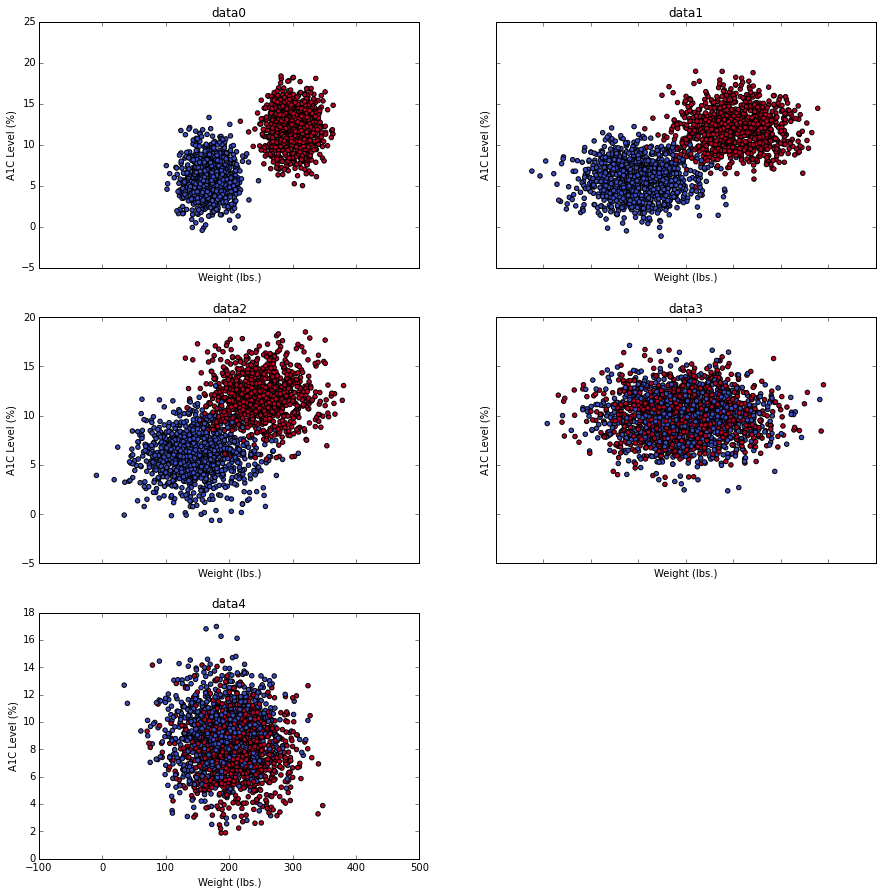
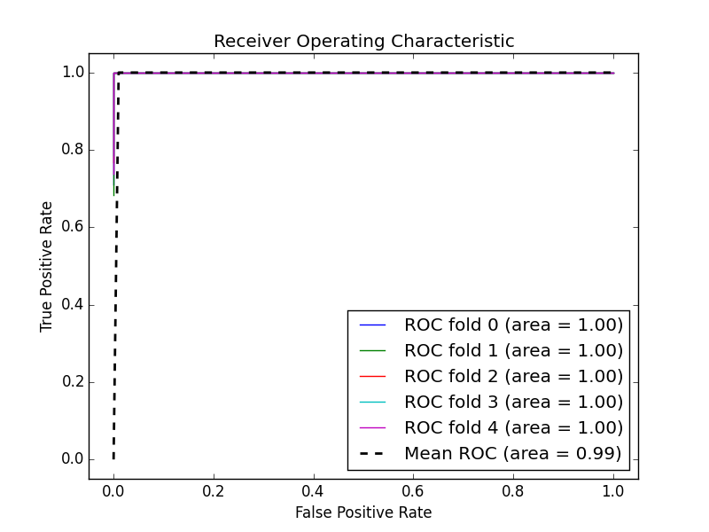
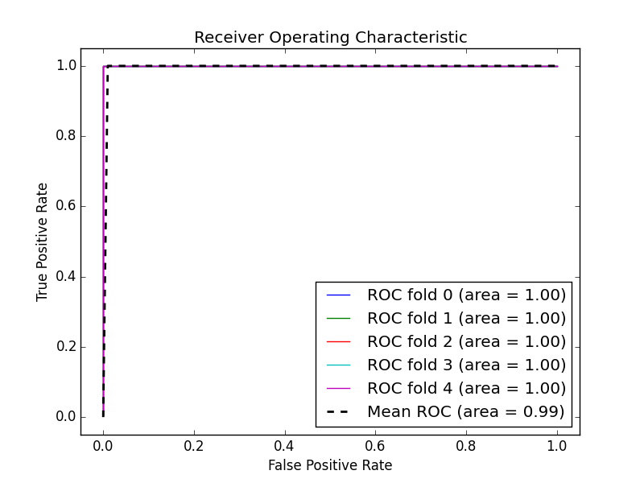
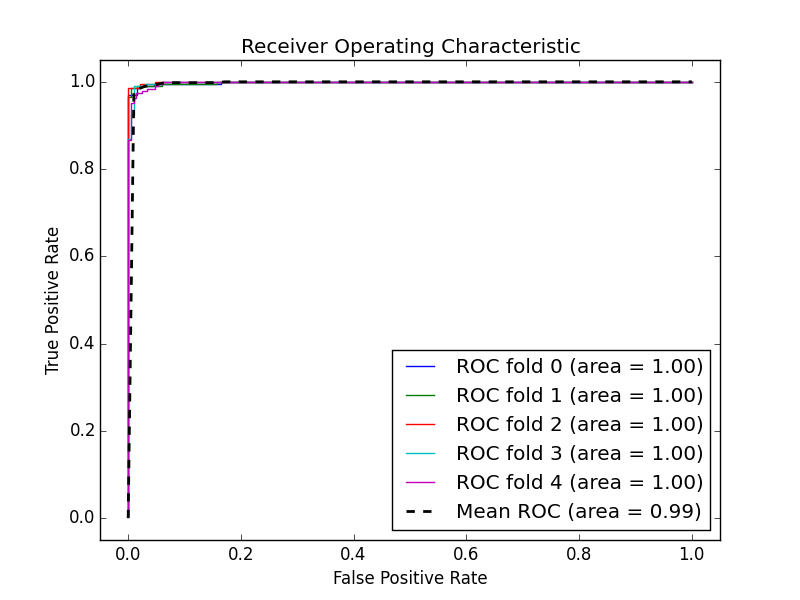
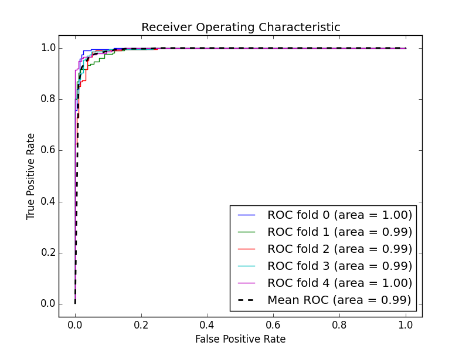
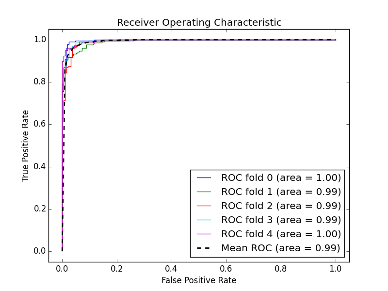
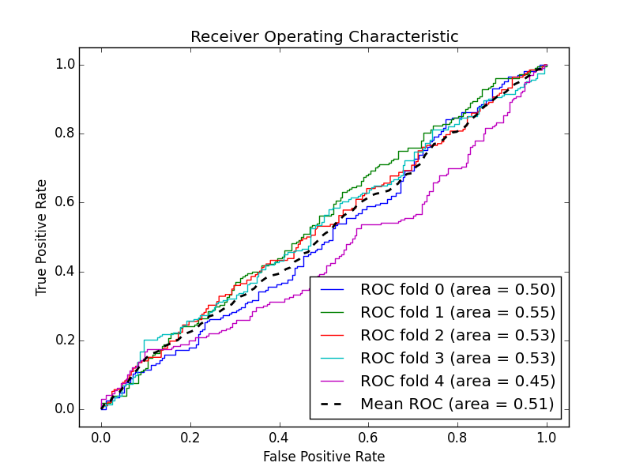
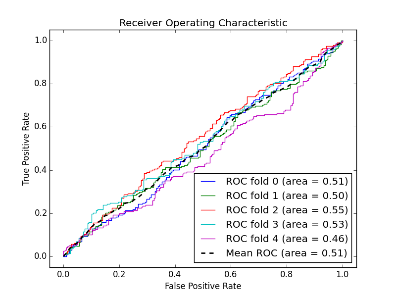
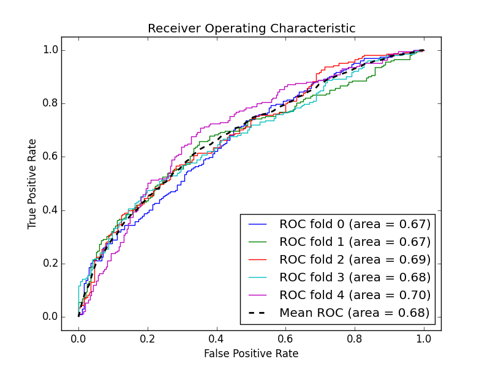
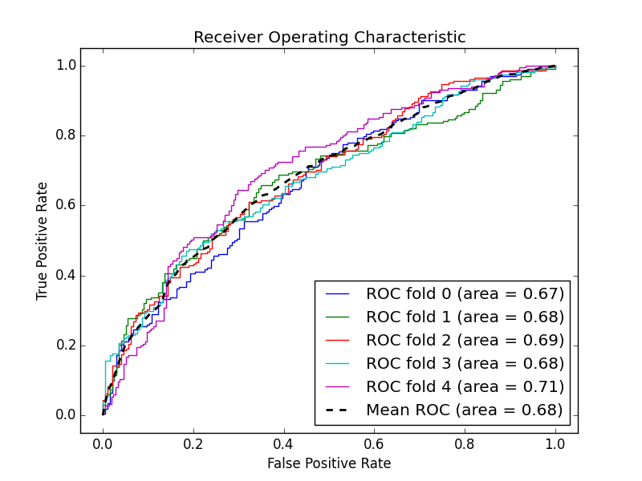

# Diabetes Classification Using NB & Logistic Regression

Using several synthetic data sets we will explore the use of Naive Bayes and Logistic Regression to classify diabetes patients. These data sets containing measurements of A1C score (a measure of blood glucose levels) and weight, as well as labels for diabetic or non-diabetic patients.

## Exploratory Analysis

Let's check the size of the data so we can get an idea of whether or not we need to bootstrap and how much data we can use for training vs testing.


```python
import os
import pickle
```


```python
data0 = pickle.load(open('data/ex_0.pickle'))
data1 = pickle.load(open('data/ex_1.pickle'))
data2 = pickle.load(open('data/ex_2.pickle'))
data3 = pickle.load(open('data/ex_3.pickle'))
data4 = pickle.load(open('data/ex_4.pickle'))
data = [data0, data1, data2, data3, data4]
```


```python
print data0[1:3, ]
```

    [[ 305.57608209   14.27104393    1.        ]
     [ 145.06291617    4.57858442    0.        ]]


The data contains weight in the first column, A1C score in the second column, and 0 or 1 to indicate if the patient is non-diabetic or diabetic, respectively, in the third column.


```python
for d in data:
    print d.shape
```

    (2000, 3)
    (2000, 3)
    (2000, 3)
    (2000, 3)
    (2000, 3)


The data all have the same size: 2000 rows, 3 columns. This should be a sufficient number of points for us to do cross-validation provided that we have balanced data sets. An unbalanced data set would contain many more labels of one type (e.g. non-diabetic), making it difficult to identify diabetic patients using some classification algorithms, such as K-NN.

Let's see how balanced the data are by printing for each data set the number of "non-diabetic" labels.


```python
for d in data:
    print d[d[:, 2] == 0].shape[0]
```

    1000
    1000
    1000
    1000
    1000


Our data is perfectly balanced, meaning that each data set contains an equal number of diabetic and non-diabetic labels. This is, of course, a synthetic data set.

## Plot
Let's plot the data to see if there are any general trends, if we can identify any outliers, or to observe any differences between the data sets. The input data is 2D so this should be straightforward. We can distinguish the "diabetic" and "non-diabetic" labels using colors.


```python
# Make figures show in the notebook, not new window
%matplotlib inline
import matplotlib.pyplot as plt
```


```python
f, ((ax1, ax2), (ax3, ax4), (ax5, ax6)) = plt.subplots(
    3, 2, sharex='col',  # Make plots share single xtick_label
    sharey='row',  # Share ytick_labels
    figsize=(15, 15))  # Make subplots grid
ax6.set_visible(False)  # Hide 6th subplot since only have 5 datasets
axs = [ax1, ax2, ax3, ax4, ax5]

for i, ax in enumerate(axs):
    # Use 'eval' to create commands from strings:
    # ax1.scatter(data0[:,0], data0[:,1]), ..., ax5.scatter(...), etc.
    ax.scatter(eval('data' + str(i))[:, 0],
               eval('data' + str(i))[:, 1],
               c=eval('data' + str(i))[:, 2],
               cmap=plt.cm.coolwarm)
    ax.set_xlabel('Weight (lbs.)')
    ax.set_ylabel('A1C Level (%)')
    ax.set_title('data' + str(i))
```





We can see clearly that `data0` displays a clear distinction in A1C score and weight for diabetic and non-diabetic patients. As we move along the list of data sets, the distinction between diabetic and non-diabetic patients becomes more blurred. This can be observed by the fact that the diabetic and non-diabetic patients move into the same cluster of patients based on A1C score and weight.

We know that these data sets are synthetic, and the latter data sets will present challenges during classification. The difficulty in classifying the latter data sets using our method will be observed in our ROC curves, sensitivity, and specificity.

## Classification & Cross-Validation

Each data set was classified using a Gaussian Naive Bayes classifier and a Logistic Regression classifier using scikit-learn. The methods of classification are fairly standard: k-fold cross-validation with 5 folders. Therefore, the classification code is not shown here.

For each classifier, sensitivity, specificity, mean accuracy, mean F1 score, and the AUC was calculated. Using these measurements and our observations about the data, we can see observe the effect of the various data sets on classification.

### Data Set: `data0`
<hr/>
#### Gaussian Naive Bayes Classifier  



Mean sensitivity: 1.0  
Mean specificity: 1.0  
Mean accuracy: 1.0  
Mean F1 score: 1.0  
Mean AUC: 1.0  

#### Logistic Regression Classifier  



Mean sensitivity: 1.0  
Mean specificity: 1.0  
Mean accuracy: 1.0  
Mean F1 score: 1.0  
Mean AUC: 1.0  

We can see that the first data set, which is almost perfectly divided by diabetic and non-diabetic patients, was able to be classified almost perfectly. Sensitivity, specificity, and accuracy are all `1.0`, which we know is slightly rounded since the mean area under our ROC curves is `0.99`.

We'll also observe below that the `data1` and `data2` were classified with relative ease by our models, based on the same metrics

### Data Set: `data1` 
<hr/>
#### Gaussian Naive Bayes Classifier  


Mean sensitivity: 0.978730591865  
Mean specificity: 0.984895772326  
Mean accuracy: 0.982  
Mean F1 score: 0.981822148507  
Mean AUC: 0.998813453976  

#### Logistic Regression Classifier  



Mean sensitivity: 0.985765406152  
Mean specificity: 0.980968272053  
Mean accuracy: 0.9835  
Mean F1 score: 0.983404106409  
Mean AUC: 0.998743486873  

### Data Set: `data2`  
<hr/>
#### Gaussian Naive Bayes Classifier  



Mean sensitivity: 0.965264325919  
Mean specificity: 0.961586015831  
Mean accuracy: 0.9635  
Mean F1 score: 0.963875829234  
Mean AUC: 0.993970750259  

#### Logistic Regression Classifier  



Mean sensitivity: 0.967206073492  
Mean specificity: 0.954585544491  
Mean accuracy: 0.961  
Mean F1 score: 0.961511293128  
Mean AUC: 0.993895696091  

Once we attempt to classify diabetic and non-diabetic patients in the data sets `data3` and `data4`, however, our ROC curve indicates that we can't do much better than guessing with these models.

### Data Set: `data3` 
<hr/>
#### Gaussian Naive Bayes Classifier  



Mean sensitivity: 0.343884140671  
Mean specificity: 0.642602352713  
Mean accuracy: 0.492  
Mean F1 score: 0.402806115464  
Mean AUC: 0.488638220036  

#### Logistic Regression Classifier  



Mean sensitivity: 0.550190403656  
Mean specificity: 0.43737873646  
Mean accuracy: 0.4885  
Mean F1 score: 0.500560433492  
Mean AUC: 0.507253570497  

### Data Set: `data4`
<hr/>
#### Gaussian Naive Bayes Classifier  



Mean sensitivity: 0.630844232587  
Mean specificity: 0.629074609407  
Mean accuracy: 0.63  
Mean F1 score: 0.630206894623  
Mean AUC: 0.681680891915  

#### Logistic Regression Classifier  



Mean sensitivity: 0.627994038188  
Mean specificity: 0.631370412533  
Mean accuracy: 0.6295  
Mean F1 score: 0.628726112816  
Mean AUC: 0.681915509854  

Guessing would naturally be defined on the ROC curve as a diagonal line going from `(0, 0)` to `(1, 1)` and an accuracy of 50%. Other methods would need to be employed, or other features used, to classify data sets similar to these last two in real life. Of course, it is also possible that the data are not correlated, so some statistical exploration and acquisition of domain knowledge prior to classification is always wise.


```python

```
