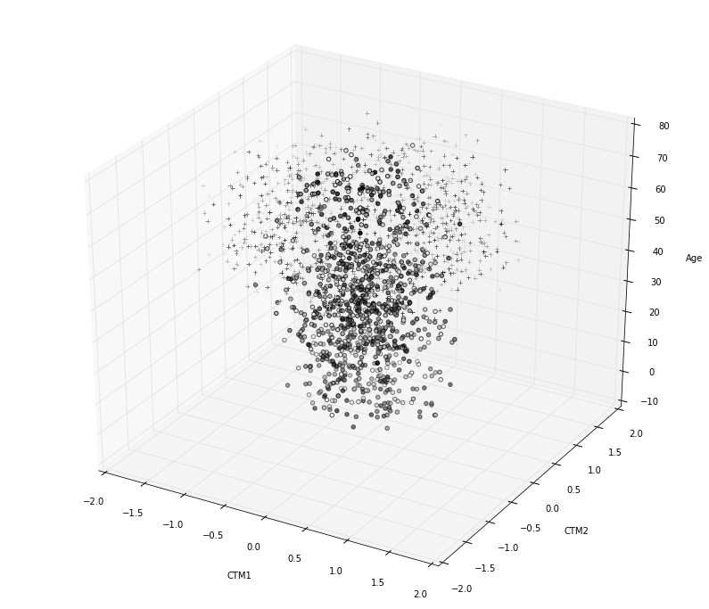

# Feature Selection Using Chi<sup>2</sup> & Random Forest

Here we explore the use feature selection using Chi<sup>2</sup> and Random Forests in scikit-learn. Chi<sup>2</sup> is a univariate statistical measure that evaluates the correlation between two variables, or the effect of one variable on another. We will leverage the feature importances returned by scikit-learn's Random Forest models to perform an additional feature selection, as well. We will compare feature-selected classification results with no feature selection results and PCA coupled with model fitting.

What follows is a very "buck-shot" and brute approach to classification, and a superficial approach to feature selection. It is simply intended to demonstrate how exploratory analysis, stats, and even machine learning models can be used to perform feature selection. There are many more feature selection methods that can and often should be used for classification.

## The Data

The data we are using contains five columns:

1. (feature1) ctm1
2. (feature2) ctm2
3. (feature3) age
4. (feature4) length of stay
5. (target) congenital heart failure, a.k.a. CHF (0 or 1)

The data is sorted so that all the 0 targets come first, then all the 1 targets follow. We therefore need to randomize the data prior to fitting any models. We will attempt to classify CHF, or congenital heart failure, after selecting the most appropriate features for classification.


```python
import numpy as np
data = np.genfromtxt('data/data.csv', 
                     delimiter=',', dtype='float64', skip_header=1)
print data[1:3, ]
print "\nShape: {}".format(data.shape)
```

    [[ -3.38301125e-01  -7.26396589e-02   1.10000000e+01   1.53000000e+02
        0.00000000e+00]
     [  2.35209736e-01   3.18892166e-02   1.00000000e+00   2.80000000e+01
        0.00000000e+00]]
    
    Shape: (2000, 5)


## Exploratory Visualizations


```python
%matplotlib inline
import matplotlib.pyplot as plt
```

Here we have four data columns, all numeric. Including the targets, we have five dimensions.
Ideally, we'd like to plot this data. We can plot three columns in a 3D cartesian coordinate
system, use a fourth feature column to color the data, and describe the targets using shapes.
This will allow us to see which features are relevant and which are not. We'll need to generate several graphs so that each of the features is used with the others in the 3D plane.


```python
import itertools
from mpl_toolkits.mplot3d import Axes3D
```


```python
print "Total data shape: {}".format(data.shape)
pos = data[data[:, 4] > .9]
neg = data[data[:, 4] < .1]
print "Positives: {}".format(pos.shape)
print "Negatives: {}".format(neg.shape)
```

    Total data shape: (2000, 5)
    Positives: (1000, 5)
    Negatives: (1000, 5)


Let's plot positive and negative CHFs with different markers.

### Figure 1


```python
fig = plt.figure(1, figsize=(14, 12))  # Easier to interpret as large graph
ax = fig.add_subplot(111, projection='3d')

ax.scatter(pos[:, 0], pos[:, 1], pos[:, 2], c=pos[:, 3], 
           cmap=plt.cm.gray, marker='+')  # Positive CHF as '+'
ax.scatter(neg[:, 0], neg[:, 1], neg[:, 2], c=neg[:, 3],
           cmap=plt.cm.gray, marker='o')  # Negative as 'o'
ax.set_xlabel('CTM1')
ax.set_ylabel('CTM2')
ax.set_zlabel('Age')
plt.show(1)
```





While this graph might at first glance appear to not explain much, it actually is explaining a lot. This insight comes after viewing the three other graphs below.

* For high `Age` values and extreme `CTM1` and `CTM2` values the diagnosis is positive
* For low `Age` the diagnoses are negative
* Data centered around the axes `CTM1` and `CTM2` at values of 0 are negative, even when `Age` increases

So, it would appear that age and high CTM1 and CTM2 values play a significant role in congestive heart failure.

### Figure 2


```python
fig = plt.figure(2, figsize=(8, 8))  # More easily interpreted as small graph
ax = fig.add_subplot(111, projection='3d')

ax.scatter(pos[:, 1], pos[:, 2], pos[:, 3], c=pos[:, 0], 
           cmap=plt.cm.gray, marker='+')
ax.scatter(neg[:, 1], neg[:, 2], neg[:, 3], c=neg[:, 0],
           cmap=plt.cm.gray, marker='o')
ax.set_xlabel('CTM2')
ax.set_ylabel('Age')
ax.set_zlabel('Length of Stay')
for angle in range(0, 360):
    ax.view_init(30, angle)
plt.show(2)
```


Positionally, this one seems to have the most differentiation between positive and negatives, at least on one axis: `Age`. The fourth variable here, `CTM1`, is used to color the data, and positive diagnoses appear to be lighter in color on average than the negative ones. In addition, `Length of Stay` seems to explain nothing here, so this column may be extraneous. This is observed by the fact that there are '+' CHF diagnoses along the entire range of `Length of Stay`.

### Figure 3


```python
fig = plt.figure(3, figsize=(10, 10))
ax = fig.add_subplot(111, projection='3d')

ax.scatter(pos[:, 2], pos[:, 3], pos[:, 0], c=pos[:, 1], 
           cmap=plt.cm.gray, marker='+')
ax.scatter(neg[:, 2], neg[:, 3], neg[:, 0], c=neg[:, 1],
           cmap=plt.cm.gray, marker='o')
ax.set_xlabel('Age')
ax.set_ylabel('Length of Stay')
ax.set_zlabel('CTM1')
ax.get_xaxis().set_ticklabels([])  # Tick labels were overlapping
for angle in range(0, 360):
    ax.view_init(0, angle)
plt.show(3)
```


`CTM1` on its own does not seem to explain anything here since along its axis we can see '+' and 'o' markers mixed throughout its whole range. It is difficult to see, but there are many '+' markers interspersed amongst the 'o' ones in the range -0.5 to 0.5.

Once again, `Length of Stay` does not help in this graph.

### Figure 4


```python
fig = plt.figure(4, figsize=(10, 10))
ax = fig.add_subplot(111, projection='3d')

ax.scatter(pos[:, 3], pos[:, 0], pos[:, 1], c=pos[:, 2], 
           cmap=plt.cm.gray, marker='+')
ax.scatter(neg[:, 3], neg[:, 0], neg[:, 1], c=neg[:, 2],
           cmap=plt.cm.gray, marker='o')
ax.set_xlabel('Length of Stay')
ax.set_ylabel('CTM1')
ax.set_zlabel('CTM2')
plt.show(4)
```


Again, `Length of Stay` doesn't explain anything here. It is likely that this column is not very highly correlated with CHF.

## Method

The data was randomized and split into 75% training and 25% test data. scikit-learn's `SelectKBest` function was used to choose the top `k=3` features based on Chi<sup>2</sup>. This number was chosen since `CTM1`, `CTM2`, and `Age` seemed to have the most influence on positive or negative CHF diagnoses based on the figures above.

A random forest classifier was fitted, using a maximum of `2` features to search for each split. Random forests determine the feature to split by on each node using some measure that either maximizes entropy or minimizes an error function, such as residual sum of squares.

The code used was fairly standard code and therefore is not included here for brevity.

## Results

| Model                 | Accuracy | Sensitivity | Specificity | F3 Score | AUC |
|-----------------------|----------|-------------|-------------|----------|-----|
| PCA + Gaussian NB | 0.892 |  0.961240310078 | 0.818181818182 | 0.948737566947 | 0.943894548017 |
| SelectKBest + Gaussian NB | 0.892 | 0.976744186047 | 0.801652892562 | 0.961098398169 | 0.980123646614 |
| Gaussian NB | 0.894 | 0.980620155039 | 0.801652892562 | 0.964544414792 | 0.980139663015 |
| Random Forest | 0.928333333333 | 0.942857142857 | 0.912280701754 | 0.940766550523 | 0.972876636035 |

For the Gaussian NB models, all features were used since this almost always yielded the best performance metrics. Logistic regression, SVM, RandomForest, K-NN, or other algorithms could have been used to classify the data. This was a binary classification problem. Keeping in line with what might be desirable in the real world where one is trying to predict CHF, F3 score was used, as opposed to F1, to emphasize the sensitivity component of the F score. True Positive rate (sensitivity) is extremely import since we want to positively identify anyone that might be at risk for CHF. If we falsely identify a few people as positive, lowering the specificity, the test can be run again to confirm a positive diagnosis. When using SelectKBest, k=3 was chosen to pick the top three features based on the data exploration that was done prior to running the classifiers on the data.

Random forest feature importances: `[0.2023839 0.16156072 0.59611528 0.0399401]`

The feature that is listed as most important by the Random Forest classifier is Age, which is not surprising. The older we get the more likely we are to experience cardiac issues. The first two measures are also important, and the last one (Length of Stay) is least important. However, for this limited data set, length of stay does seem to assist the classifiers in correctly predicting CHF or no CHF. This might be explained perhaps by people with CHF staying in the hospital after their CHF, or those who are in the hospital frequently have pre-existing heart conditions. Not knowing where the data comes from, I might or might not be inclined to leave the Length of Stay feature out. If I were to build a model as a predictor of CHF, I would only leave Length of Stay in if the values here are Length of Stay prior to the CHF. Otherwise, I would leave that feature in when building a model since it improves the prediction metrics.

The random forest feature importances could suggest to leave `Length of Stay` out when building future models. However, comparison of `SelectKBest + Gaussian NB` and `Gaussian NB` shows that the full `Gaussian NB` model performed slightly better than the 3-feature one, also indicating that `Length of Stay` was slightly helpful in classification.